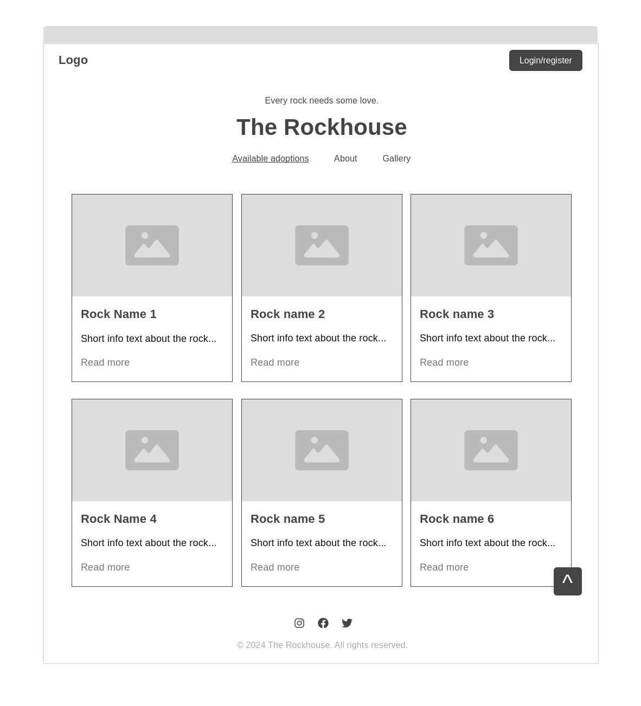
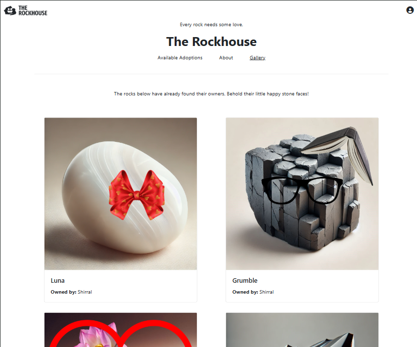

# The Rockhouse

["The Rockhouse"](https://github.com/Shirral/The-Rockhouse) is a fictional virtual pet rock adoption centre. The idea is simple: adopt a rock of your choice - they all have their unique qualities: material, texture, even personality - and enjoy the status of a proud rock owner, all without the hassle of shipping and having to have physical space for your new pet rock, while supporting a group of rock enthusiasts who care for it at their facility in your name! It's just like adopting an animal at the zoo. Except it's about rocks. And while you won't have your rock with you in person, it will sit proudly in your online profile for all to see. There, you can use the customisation tool to dress it up with silly accessories, add a frame, and show it off to the world!

## User Experience & User Interface (UX/UI)

### Site goals

The goal of the site is to offer the user a unique way of showcasing their passion for rocks while supporting the world of geology and the people enthusiastic about by giving them an option to virtually adopt one (or many) of the rocks available at the website. It aims to make the experience fun and rewarding by making each and every rock unique, using humour in the way the rocks are presented as if they were living pets, and giving the user a way to customise their rock by accessorising it after it's been adopted.

### User stories

**First time visitor goals:**

* As a first time visitor, I want to learn what The Rockhouse is and why would anyone want to adopt a virtual rock.
* As a first time visitor, I want to have a look at the rocks available at the website.
* As a first time visitor, I want to see what's in the gallery.
* As a first time visitor, I want to create an account.

**Returning visitor goals:**

* As a returning visitor, I want to log in to my account.
* As a returning visitor, I want to change my email or password.
* As a returning visitor, I want to adopt a rock.
* As a returning visitor, I want to customise my rock.
* As a returning visitor, I want to add a note about my rock.
* As a returning visitor, I want to see other people's rocks.
* As a returning visitor, I want to request an accessory that is not available in the customisation app to be added to it.
 
**Website administrator goals:**

* As the website administrator, I want to add new rocks and accessories.
* As the website administrator, I want to make quick changes to rocks available for adoption without having to go to the admin panel.
* As the website administrator, I want to see the accessory requests from the users.
* As the website administrator, I want to see the information on the new adoptions. 
* As the website administrator, I want to change any user's profile information like email or password in case they have lost access to their email and cannot access their account. 

### Design

**Colour scheme**

The colour scheme of The Rockhouse is very minimalistic. It uses Bootstrap's main colours - white, dark grey (#212529), and light grey (#6c757d) - and Bootstrap's default colours for the alert messages: red for errors/danger, yellow for warnings, blue for information, and green for success.

**Typography**

Focused on functionality rather than design, The Rockhouse uses Bootstrap's default native font stack settings, which use the user's current system font. This ensures the design will always remain clean, functional and easy to read, while not requiring the user to load any additional external font resources. Basic sans-serif web fonts are provided as fallbacks.

**Imagery**

As the website is all about the rocks, the spotlight is on them. The images of the rocks available for adoption are vibrant and enticing - the rocks are supposed to draw attention with their colours, shapes and textures. They are presented on soft, neutral backgrounds.

The images of accessories currently available in the customisation app are examples sourced from stock picture websites; ideally, the website administrators would create all of the accessories and frames themselves, keeping them stylistically cohesive and making sure they fit the shapes of every rock available in The Rockhouse well, and add new accessories to the app regularly.

**Wireframes**

The wireframes made in the planning stage of the project work have guided me later on. I followed them rather closely, intending to keep the project's design minimalistic right from the start. I have decided not to include several elements that have been included in the wireframes and to add others which haven't been planned there, though. The wireframes have been prepared with Wireframe.cc.

## Features

### Responsive design

The website responds to a wide variety of screen sizes. Bootstrap framework handles most breakpoints automatically, but a few elements have been given their own media queries to work better across different screens.

### Messages - alerts

Django's messages with Bootstrap alert styling are used to provide feedback to the user. Displayed at the very top of the page, right below the navigation bar, they inform the user of the successful/unsuccessful actions, inform them when they've been redirected to another page because the page they were trying to visit is not available to them, and so on.

### Navbars

The website features two navbars - the main, more robust one used on the three pages presented to a non-logged in user: Active Adoptions, About, and Gallery - and the secondary, more condensed one, used on all the other pages. The secondary navbar looks more like a standard navbar and it features reversed colours.

Both navbars have the same functionality. They showcase the website's logo in the top left corner of the screen and the profile icon with a dropdown profile menu in the top right corner; however, that icon is replaced by a bigger "log in/register" button in the main navbar if the user is not logged in.

The main links displayed in both navbars are the same: Active Adoptions, About, and Gallery. The main navbar, used on these three pages, underlines the name of the active page.

The profile dropdown menu lets the non-logged in user to log in (they can then choose to register if they don't have an account yet). The logged in user has more options - they can navigate to their profile, access the accessory request form, manage their email information, change their password, or log out. The website administrators will also find the link to the Django admin panel there.

On smaller screens, the navbars get compressed. The logo only shows The Rockhouse's icon, and, in case of the secondary navbar, all the links - including the profile dropdown - get hidden in the burger icon that gets displayed on the right side of the navbar.

Expanded mobile navbar:

### Footer

Minimalistic footer with links to social media pages. Sticks to the bottom of the page.

### Homepage - Available Adoptions

The homepage is where all of the rocks available for adoption are shown in a responsive grid (3 rocks per row on largest screens, 2 on medium ones, 1 on the smallest ones). Every rock is displayed using Bootstrap's card functionality.

Each card shows an image of the rock in question on the top, its name below it, then a short description, and a "see more" link. The link leads to the rock's individual profile page. The user can also click on the rock's picture to get there.

Website administrators will also see a link to edit each rock on their cards, to the right of the rock's name.

### Gallery page

The gallery page works in the same way as the homepage, but it displays the rocks that have been adopted along with the accessories their owners have added to them. The cards focus on the images of the rocks and they take up much more space to display them well (grid: 2 rocks per row on most screens, 1 per row on small screens). Other than the image, the cards show the rock's name and the name of their owner which can be clicked on to access their profile. The image of the rock can also be clicked on, to access the rock's profile page.

### About page

The about page provides the information about The Rockhouse. It has three sections: What is The Rockhouse?, How it all began..., and Core team. It's meant to get the user acquainted with the core ideas behind The Rockhouse as well as the people behind it.

### Account management

The account management is provided through [django-allauth](https://docs.allauth.org/en/latest/). It takes care of the registration of users, logging in and out, changing passwords and email management. The core templates used by the website have been styled to fit in with the visual style of its elements.

### Rock profile page

The rock profile page displays a large image of the rock in question and detailed information about it: its name, material, texture, personality, and a description for all the rocks, as well as whether it's available for adoption and its cost and a button to proceed with the adoption for the rocks that don't yet have owners. For the rocks owned by the users, the name of the owner is shown instead, along with the user's notes about the rock, if they've added any, and any accessories they might have added to their rock.

The website administrators can also access the rock edit page from here - but only if the rock hasn't been adopted yet. It might be a bad idea to edit rocks that have already been adopted, so such operations should not be easily accessible - the administrators can still do that from the admin panel if they have a good reason to do so.

If the rock is available for adoption, the user will also see a link leading them back to the Available Adoptions page on the bottom of the page.

### Rock edit page

The rock edit page is a quick access for the administrators to edit the basic properties of the rock without having to go to the admin panel. It is designed to look like the rock profile page, but with editable fields, for a smooth transition between the read-only and the editing view if the site administrator navigates there from the rock profile page. The administrators can use it to change the rock's name, material, texture, personality, adoption cost, and a description. They can also delete the rock - clicking on the delete link will lead the administrators to the conformation modal which will also show a warning if the rock is owned by a user, in which case deleting it might be a pretty poor idea. The rock will be deleted if the user confirms their decision.

### Adoption confirm page

This page presents the user with more information on the adoption process and gives them an option to either continue with the adoption or to go back to the Available Adoptions page.

### Adoption form page

This page handles the actual adoption process. The users are presented with the form to fill and with a Stripe card payment widget. The form will throw errors if any requirements of the fields are not met, asking the users to fix their inputs. When the user clicks on the "complete adoption" button with the form filled correctly, Stripe will attempt to colelct the payment adn return the infromation on whether that went well to the page. If all goes well, the RockAdoption object gets created in the database, the rock gets assigned to the user, the adoption process is finished and the user gets redirected to the Adoption success page.

### Adoption success page

This page confirms a successful adoption, thanks the user, and tells them where to find their new rock. It also presents them with a link to the customisation tool.

### User profile page

This page displays all the rocks owned by a particular user using the same grid/card layout as the homepage. However, here the cards are also showing when each of the rocks was adopted, and the accessories if it has any. If the user viewing the profile is its owner, they will also see a link to the customisation tool next to their rock's name.

The page also shows basic information about the user - their username, date they joined The Rockhouse, and the number of rocks they've adopted so far.

### Customisation page

The customisation page features the customisation tool which allows the user to accessorise their rock. All of the accessories from the database are sorted into accessories and frames and displayed in separate foldable containers provided by Bootstrap's accordion functionality. The user can pick as many accessories as they like, but only one frame.

The chosen accessories and frames will be displayed on the rock image instantly. If the user decides to save their selection, the chosen accessories will be saved to the rock object and the rock will be displayed with the accessories on in every place where it can be seen on the website.

The customisation page also gives the user an option to add notes about their rock which will be publicly displayed on their rock's profile page. It also contains a link to the accessory request form.

### Accessory request page

The accessory request page contains a form through which the users can request for an accessory that is not in the app yet to be added by the admins. The users should provide a descriptive name of the accessory, its desired colour, type selected from a dropdown menu (accessory/frame), and a detailed description. They can also provide an image of what they have in mind to serve as a visual example.

The form needs to be valid to be submitted.

### Django admin

Django's built-in admin panel. This is where the site administrators can access and alter all of the objects from the databases fully. It is used to add new rocks and accessories to the website, edit and delete existing ones, view new adoptions and accessory requests, and manage users' account information in situations where they lose access to their login details and cannot retrieve or reset them themselves.

### Future features

Some of the initially planned features did not get implemented due to the lack of time. Others came to me as I was working on the project, as something that would be nice to add to the website at some point. Here is a list of things I would like to add to The Rockhouse:

* **Better styling.** Although the website's design is supposed to be minimalistic, a lot could still be made better to improve the consistency of the design and the visual performance of the site across varied screen sized.
* **Sending custom confirmation emails after a successful adoption.** Although the users don't have to track any shipping and wait for their rocks to be delivered - they're available in their profiles instantly, providing all the feedback necessary that everything went well, and the confirmation page is there to say thank you to the user - it would still be more professional to also send an email.
* **Custom error pages.** To fit with the design of the page better and provide navigation links to the user.
* **Custom admin panel.** As above.
* **Saving user's billing information in their profile for later.** It would improve the experience of the users who adopt multiple rocks.
* **Rendering allauth's forms for the small screens and the big screens in the backend depending on the screen size rather than displaying the right one in the frontent whie both exist in the DOM.** This would allow to avoid console warnings about duplicate ids that I can't really change without messing with allauth too much in the allauth templates that use different layouts for smaller screens and bigger screens.
* **Using a Stripe webhook rather than Stripe's latest version of payment intent to confirm whether the adoption was successful.** Although the current solution works well, it's not as good as using the webhook and I would have chosen it if I had more time to work on the project.
* **Allowing users to choose their accessories by clicking on the accessory picture rather than on a small checkbox/radio button, and hiding the latter altogether.** It would look much better and be much easier to use.
* **A visual notification on the navbar for the site administrators if there are any new accessory requests and/or adoptions.**
* **Custom images of sample accessories.** The current ones are not visually appealing nor stylistically cohesive.
* **Several versions of each accessory that fit every rock shape.**
* **Separate preview pictures from the accessories that would be used for the selection of the accessory while the actual image of the accessory would be applied to the rock.**
* **Adding profile pictures to user profiles and allowing the users to either upload their own, or to use the image of one of their rocks.**
* **Customising allauth's emails.**
* **Allowing non-logged-in users to log in through a modal, without leaving the adoption form page, when they're there.**
* **Accessories shop.** It would be great to have free accessories available to all users and paid ones, only assigned to a user's account once they buy it - or obtain it in a different way, eg. through engagement on The Rockhouse's social media, through an event, competition, etc.
* **Accessory request form as a way of ordering custom accessories.** These would only be available to the user who ordered these and paid for them; it would be more engaging for the user and it would be an additional income stream for The Rockhouse.
